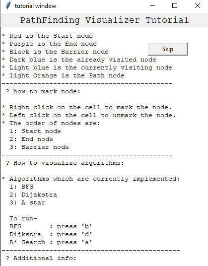
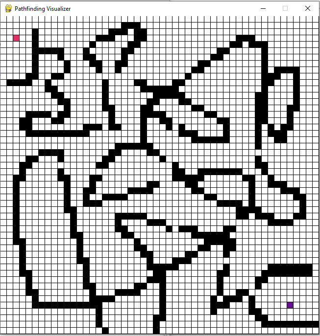
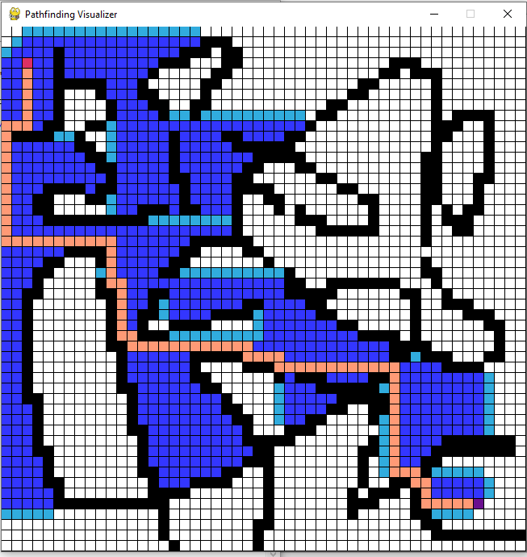
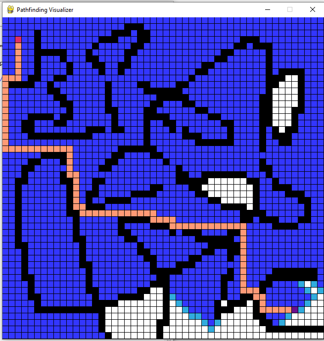
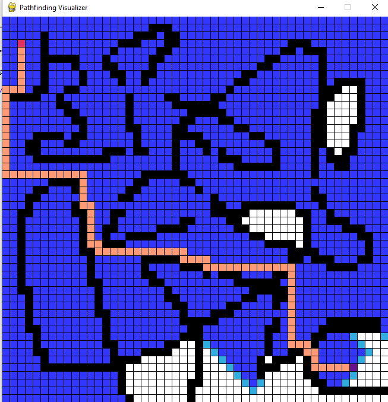

 

# Pathfinding-Visualizer🚀
A visualization tool made in Pygame for various pathfinding algorithms.

Pathfinding is closely related to the shortest path problem, within graph theory, which examines how to identify the path 
that best meets some criteria (shortest, cheapest, fastest, etc) between two points in a large network.

## Pathfinding Algorithms in the Visualizer :
* BFS (Breadth First Search)
* Dijkstra's algorithm
* A* Search algorithm

## Features:
* User can specify the start node🟥, end node🟪 and barrier nodes⬛.
* To run: 
<pre>
 BFS       : Press the 'b' key 
 Dijkstra  : Press the 'd' key 
 A* Search : Press the 'a' Key 
 Reset     : Press the 'c' Key 
 Reset the visualization part: Press the space bar
</pre>
* User can reset the whole board or they can just clear out the visualization part . 
* More information on the features and 'How to use' are given in the tutorial window of the app.

## Demo
* Tutorial window:  

* Nodes marked by the user:

* A* Search algorithm visualization:

* Dijkstra algorithm visualization:

* BFS visualization:

